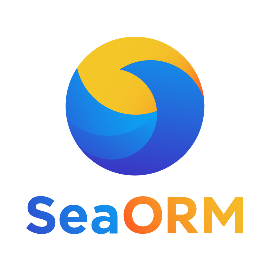
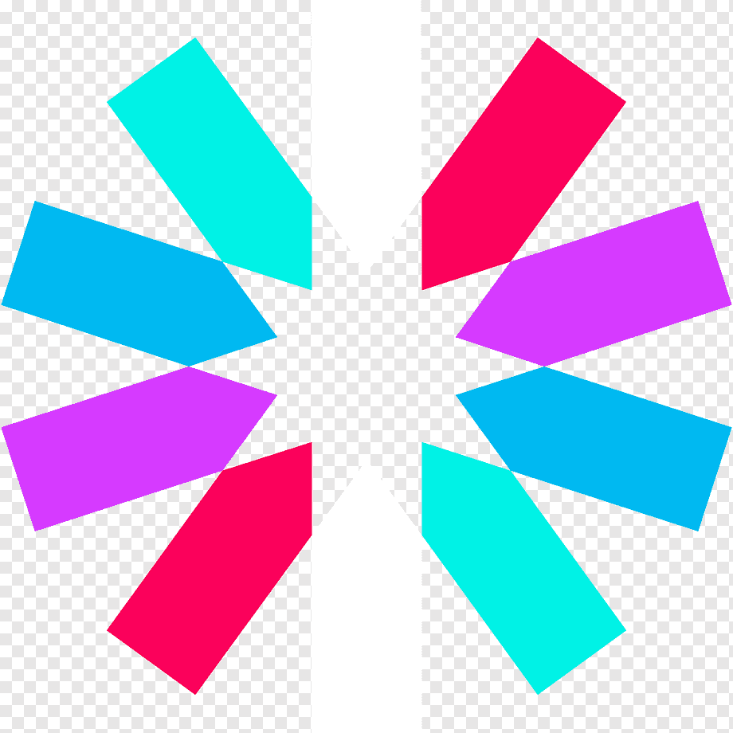
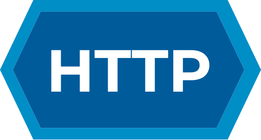

# Hi there, I'm Obed Domínguez 👋

## 💫 About Me:

I'm a Computer Systems Engineering student with a strong interest in Fullstack Development, Machine Learning, Blockchain & Web3, Data Analysis, Database Modeling, and Networking.

I've developed robust RESTful APIs both independently and while leading small teams, and I enjoy building real-world software that solves practical problems. I'm passionate about learning by doing and constantly expanding my knowledge through hands-on projects.

## 🛠️ My skills:

<table style="display: flex; justify-content: center">
  <tr>
    <td align="center"><strong>Languages 🌟</strong></td>
    <td align="center"><strong>Front-End 🎨</strong></td>
    <td align="center"><strong>Back-End ⚙️</strong></td>
  </tr>
  <tr>
    <td valign="top">
        
      
      
      
      
      
    </td>
    <td valign="top">
      
      
      
    </td>
    <td valign="top">
      
      
      
      
    </td>
  </tr>
</table>

<table style="display: flex; justify-content: center">
  <tr>
    <td align="center"><strong>Tools ⚙️</strong></td>
    <td align="center"><strong>Databases 🗄️</strong></td>
    <td align="center"><strong>Protocols </strong></td>
  </tr>
  <tr>
    <td valign="top">
      
      
      
      
      
    </td>
    <td valign="top">
      
      
    </td>
    <td valign="top">
      
    </td>
  </tr>
</table>

## 🌐 Socials:

  

  

## ⚡ Stats:

<table style="display: flex; justify-content: center">
  <tr>
    <td colspan="2" align="center"><strong>Stats 📈</strong></td>
  </tr>
  <tr>
    <td valign="top" align="center">
      
    </td>
    <td valign="top" align="center">
      
    </td>
  </tr>
  <tr>
    <td valign="top" align="center">
      
    </td>
    <td valign="top" align="center">
      
    </td>
  </tr>
</table>
